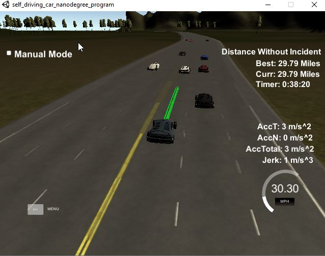

# CarND-Path-Planning-Project
Self-Driving Car Engineer Nanodegree Program
---

---
## Introduction

In this project an algorithm for path planning will be implemented for an ego car in simulation environment to drive itself though a test track around 7 Km. Every 0.02 second the simulator provides car information and fusion information of other cars in the highway and takes the generated trajactory to control the ego car.

## Code model

The path planning algorithm is implemented in three steps: vehicle prediction, behavior generation and trajectory generation

### [Prediction](./src/main.cpp#L161)

In this step sensor fusion data is provided by the simulator and used as input for prediction of vehicles on the road. The sensor fusion data is including Frenet coordination d and s and component velocity vx and vy in cartestian system. From this information position of other cars on the road will be predicted, such as next d and s coordination of the other cars.

If another car is driving on the same line of the ego car and the distance between them is smaller than 30 meters, it will be recognized by the ego car.
If another car is driving on the right or left lane to the ego car and the car is in 30 meters in front of the ego car or 10 meters behind the ego car, it will be recognize by the ego car.

### [Behavior generation](https://github.com/truongconghiep/CarND-Path-Planning-Project/blob/e7fbbcd126edfb650c73bdd29905fa699211c331/src/main.cpp#L32)

In this step the reaction of the car on situations on the road will be generated. If another car is detected ahead, the ego car will change to the left or right lane if no car is detected on these lanes. Otherwise it will slow down and follows the car ahead and waits until other lanes are free. If no car is detected ahead the ego car, it will keep driving on the same lane if the current lane is in the middle of the road. Otherwise it will try to move to the middle lane if the lane is not occupied by other vehicles. If the middle lane is not free the ego car will keep driving ahead in the same lane until the middle lane free.

### [Trajectory generation](https://github.com/truongconghiep/CarND-Path-Planning-Project/blob/e7fbbcd126edfb650c73bdd29905fa699211c331/src/main.cpp#L213)

In this step new trajectory will be calculated based on the generated behaviour and the previous path.

To keep the car driving smoothly, the  [last two waypoints](https://github.com/truongconghiep/CarND-Path-Planning-Project/blob/e7fbbcd126edfb650c73bdd29905fa699211c331/src/main.cpp#L224) of the previous path will be added to the new trajectory as two first points. At the start the previous path is empty, so the pevious and current car positions will be used.
Next, from the generated behaviour including lane and speed [three waypoints](https://github.com/truongconghiep/CarND-Path-Planning-Project/blob/e7fbbcd126edfb650c73bdd29905fa699211c331/src/main.cpp#L255) will be generated in Frenet system evenly 30m spaced ahead of the starting reference. From these five waypoint a spline will be determined. The other waypoints are calculated based on reference velocity and the spline. To keep the trajectory continuity, the generated path is added up on top of the previous trajectory. Then, the entire trajectory is passed to the simulator to control the ego car

## Result

The path planning is working well on the test track, which drives the car through a long distance without collision with other vehicles or unexpected jerk.

